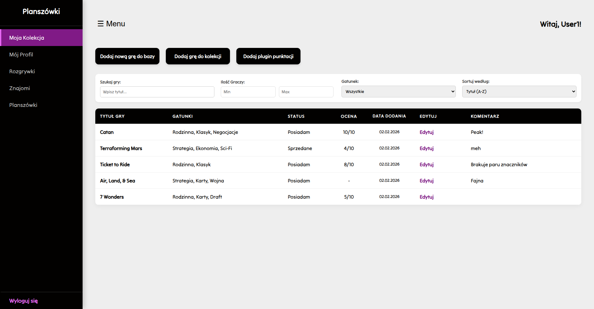
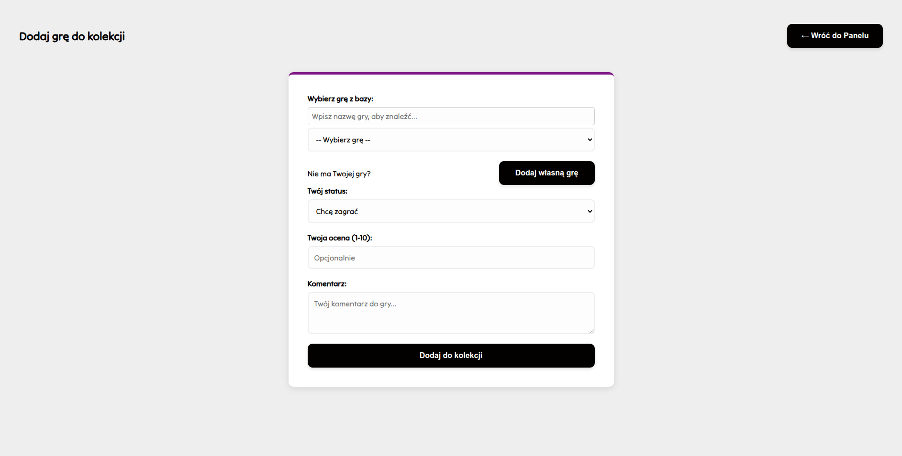
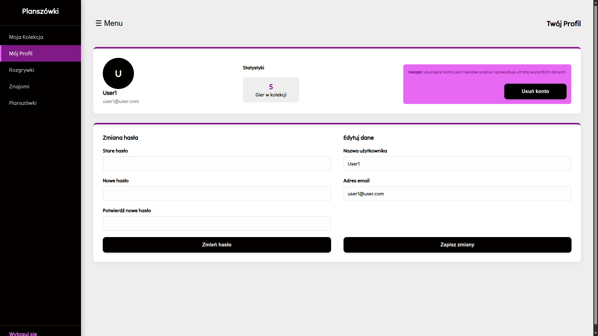
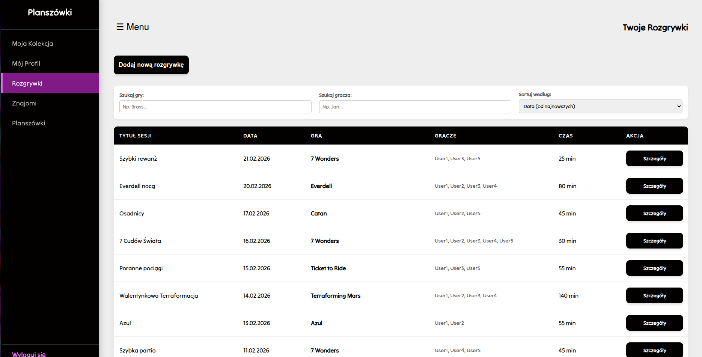
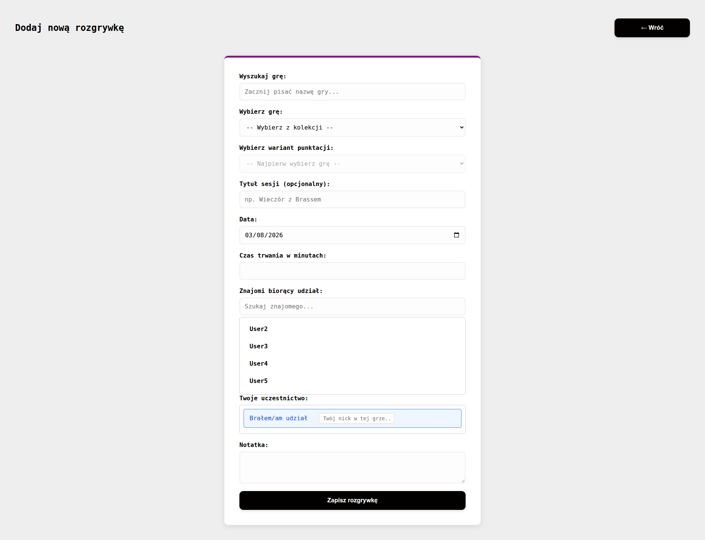
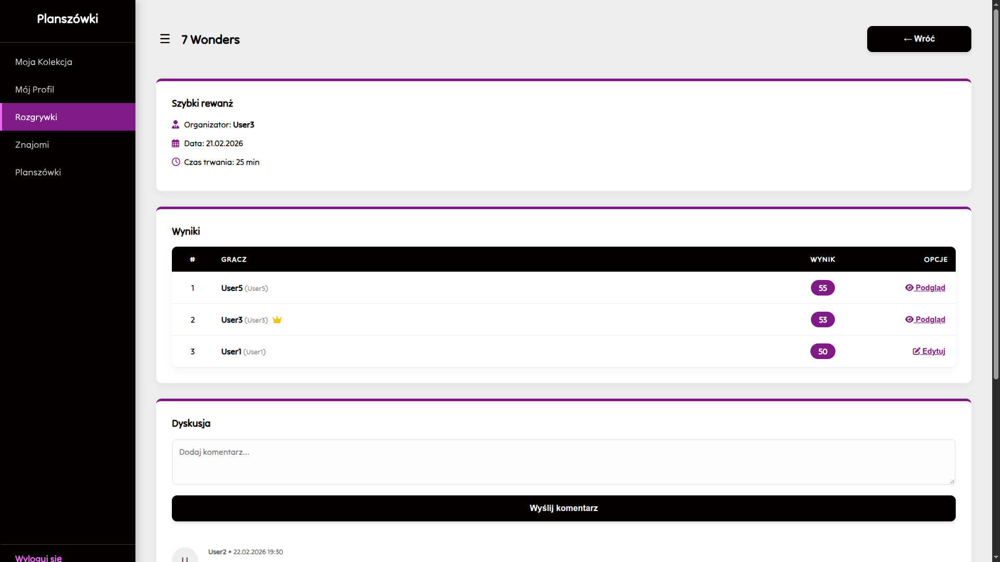
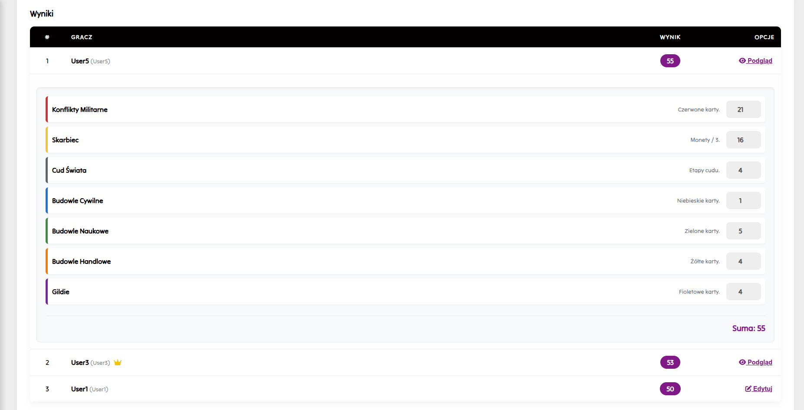
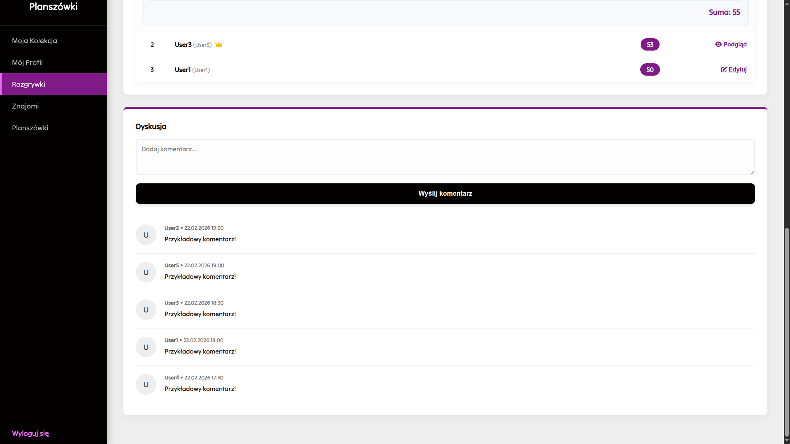
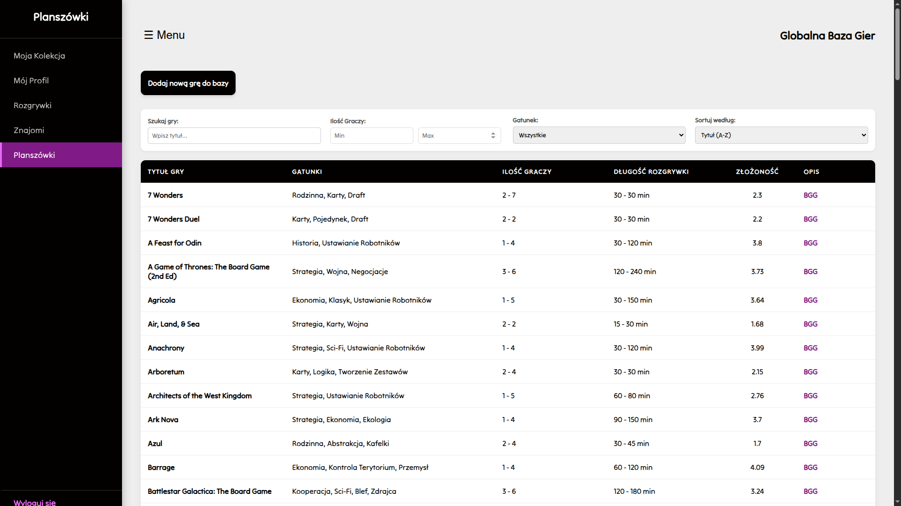
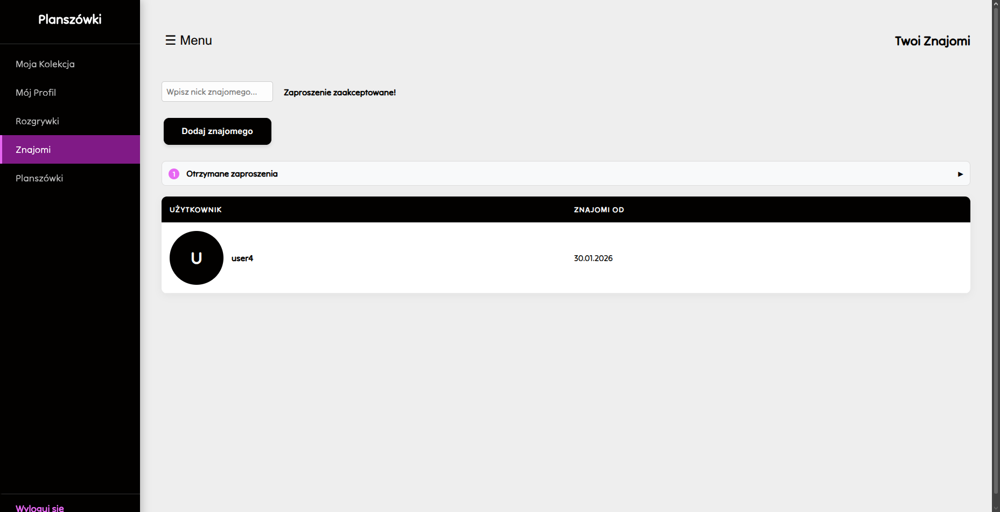

# Board Game Collection and Match Management Application

## Project Description

Application created for the "Database Systems" course at Wrocław University of Science and Technology.

The goal of the project was to design and implement a database application.

**Built with:**
- HTML
- CSS
- PHP 8.2.12
- vanilla JS
- MariaDB  10.4.32

## Features

- **Collection Browsing and Filtering:** The My Collection panel allows the user to browse their game collection and filter games by title, genre, or player count. It also allows sorting by metrics such as weight, release date, or alphabetical order.



- **Collection Management:** Allows the user to create their own game collection. Track status, add ratings, and notes to individual titles.



- **User Profile:** The My Profile panel allows the user to delete their account, change their account details, or update personal information.



- **Match Logging:** Record individual game sessions, including date, duration, organizer, and participating players. 





- **Comments and Scoring:** After viewing match details, the organizer or an invited participant can add comments and adjust scores. In the extended scoring view, the user can enter scores into specific categories, which are then tallied and displayed as total points received. 







- **Custom Scoring Plugins:** An advanced JSON-based plugin system allows users to create custom score sheets tailored to the specific mechanics of different board games.

Example JSON:

<details>
<summary>Click to view the example JSON</summary>

```json
{
  "meta": {
    "version": "1.0",
    "author": "System",
    "score_guide": "TR + Plansza + Karty."
  },
  "ui": { "title": "Terraformacja Marsa", "description": "Arkusz końcowy." },
  "categories": [
    {
      "id": "tr",
      "name": "Współczynnik Terraformacji (TR)",
      "color": "#F44336",
      "input_type": "number",
      "default": 20,
      "description": "Twój bazowy TR na koniec gry."
    },
    {
      "id": "awards",
      "name": "Nagrody i Tytuły",
      "color": "#FF9800",
      "input_type": "number",
      "default": 0,
      "description": "Punkty za ufundowane Nagrody i Tytuły."
    },
    {
      "id": "greencity",
      "name": "Plansza (Zieleń/Miasta)",
      "color": "#4CAF50",
      "input_type": "number",
      "default": 0,
      "description": "Punkty za obszary zieleni i miasta (oraz obszary przyległe do miast)."
    },
    {
      "id": "cards",
      "name": "Punkty z Kart",
      "color": "#2196F3",
      "input_type": "number",
      "default": 0,
      "description": "Symbole Jowisza, zwierzęta, mikroby i inne VP na kartach."
    }
  ]
}

```

</details>

- **Global Board Game Database:** Available in the Board Games panel, this is a database of all global board games as well as those defined by the user. It contains specifications such as genres, player count, game length, and complexity. Each board game includes a link to the BoardGameGeek platform.



- **User Authentication and Social Features:** User registration and login system, featuring friends management and invitations. 



- **Database Archiving:** Includes automated SQL stored procedures that securely archive match records older than 5 years, maintaining query performance in the main tables.

- **Security:** Registration and login utilizing password hashing (bcrypt algorithm). Protection against CSRF attacks via a session token system. Instead of permanently deleting records, the system offers a "soft delete" function that anonymizes the user's personal data (replacing the name with a random identifier and removing the email), preserving the consistency of match history and game statistics.

Report: [Link](./images/Bazy_Danych_Sprawozdanie.pdf)

## Installation Instructions

1. Clone the repository to your local environment.
2. Import the `sql/baza_planszowek.sql` file into your MariaDB server to create the schema, relational constraints, triggers, and stored procedures.
3. Configure the database connection details in the `api/db.php` file (using the `db_github.php` template).
4. Run the application using a local web server that supports PHP.
5. Navigate to the `index.php` file (which will automatically redirect to `login/index.php`) to register a new account and start using the application.
