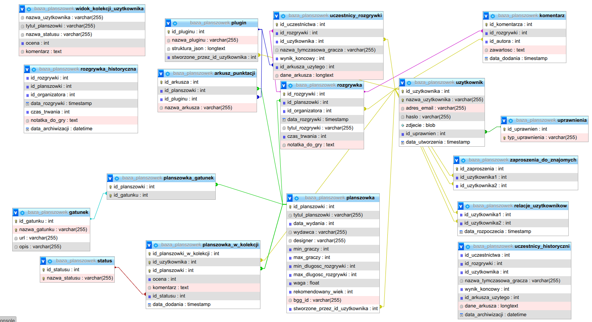

# Aplikacja do zarządzania kolekcją planszówek i rozgrywek

## Opis Projektu

Aplikacja stworzona na potrzeby kursu "Bazy Danych" na Politechnice Wrocławskiej.

Celem projektu było zaprojektowanie i implementacja aplikacji bazodanowej

**Stworzona przy użyciu:** 
- HTML
- CSS
- PHP 8.2.12
- vanilla JS
- MariaDB  10.4.32

## Diagram ERD



## Funkcje

- **Przeglądanie Kolekcji i filtrowanie:** Panel Moja Kolekcja możliwia użytkownikowi przeglądanie swojej kolekcji gier oraz filtrowanie gry po tytule gatunku lub liczbie graczy. Pozwala również na sortowanie według takich wskaźników jak waga, data wydania czy kolejność alfabetyczna.


- **Zarządzanie Kolekcją:** Umożliwienie uzytkownikowi tworzenie własnej kolekcji gier. Śledzenie statusu, dodawanie ocen oraz notatek do poszczególnych tytułów.


- **Profil Użytkownika:** Panel Mój Profil umożliwia użytkownikowi na usunięcie konta, zmianę konta lub zmianę danych osobowych.


- **Rejestrowanie rozgrywek:** Zapisuj poszczególne sesje gier, w tym datę, czas trwania, organizatora i uczestniczących graczy.


- **Komentarze i punktacja:** Po wyświetleniu szczegółów rozgrywki organizator lub zaproszony uczestnik, może dodawać komentarze oraz zmieniać punktacje. W rozszerzonym widoku punktacji użytkownik może wpisać wynik w poszczególne kategorie za które otrzymał punkty, a zostaną one podliczone i wyświetlone jako otrzymane punkty.


- **Niestandardowe wtyczki punktacji:** Zaawansowany system wtyczek oparty na formacie JSON pozwala użytkownikom tworzyć niestandardowe arkusze punktacji dostosowane do specyficznej mechaniki różnych gier planszowych.

Przykładowy JSON:

<details>
<summary>Kliknij aby zobaczyć przykładowy JSON</summary>

```json
{
  "meta": {
    "version": "1.0",
    "author": "System",
    "score_guide": "TR + Plansza + Karty."
  },
  "ui": { "title": "Terraformacja Marsa", "description": "Arkusz końcowy." },
  "categories": [
    {
      "id": "tr",
      "name": "Współczynnik Terraformacji (TR)",
      "color": "#F44336",
      "input_type": "number",
      "default": 20,
      "description": "Twój bazowy TR na koniec gry."
    },
    {
      "id": "awards",
      "name": "Nagrody i Tytuły",
      "color": "#FF9800",
      "input_type": "number",
      "default": 0,
      "description": "Punkty za ufundowane Nagrody i Tytuły."
    },
    {
      "id": "greencity",
      "name": "Plansza (Zieleń/Miasta)",
      "color": "#4CAF50",
      "input_type": "number",
      "default": 0,
      "description": "Punkty za obszary zieleni i miasta (oraz obszary przyległe do miast)."
    },
    {
      "id": "cards",
      "name": "Punkty z Kart",
      "color": "#2196F3",
      "input_type": "number",
      "default": 0,
      "description": "Symbole Jowisza, zwierzęta, mikroby i inne VP na kartach."
    }
  ]
}


</details>

- **Baza wszystkich planszówek:** Dostępna w panelu Planszówki jest to baza wszystkich planszówek globalnych oraz tych zdefiniowanych przez użytkownika. Zawiera specyfikacje takie jak gatunki, ilość graczy, długość gry oraz złożoność. Przy każdej planszówce znajduje się link do platformy Board Game Geek.


- **Uwierzytelnianie użytkowników i funkcje społecznościowe:** System rejestracji i logowania użytkowników, z funkcją zarządzania znajomymi i zaproszeniami.


- **Archiwizacja bazy danych:** Zawiera zautomatyzowane procedury składowane SQL (stored procedures), które bezpiecznie archiwizują zapisy rozgrywek starsze niż 5 lat, utrzymując wydajność zapytań w głównych tabelach.

- **Bezpieczeństwo:** Rejestracja i logowanie z wykorzystaniem funkcji password hash (algorytm bcrypt). Ochrona przed atakami CSRF poprzez system tokenów sesyjnych. Zamiast trwałego usuwania rekordów, system oferuje funkcję ”soft delete”, która anonimizuje dane osobowe użytkownika (zamiana nazwy na losowy identyfikator, usunięcie maila), zachowując spójność historii rozgrywek i statystyk gier.

Sprawozdanie: [Link](./images/Bazy_Danych_Sprawozdanie.pdf)

## Instrukcja instalacji

1. Sklonuj repozytorium do swojego lokalnego środowiska.
2. Zaimportuj plik sql/baza_planszowek.sql do swojego serwera MariaDB, aby utworzyć schemat, ograniczenia relacyjne, wyzwalacze i procedury składowane.
3. Skonfiguruj szczegóły połączenia z bazą danych w pliku api/db.php (template db_github.php).
4. Uruchom aplikację za pomocą lokalnego serwera WWW obsługującego PHP.
5. Przejdź do pliku index.php (który automatycznie przekieruje do login/index.php), aby zarejestrować nowe konto i rozpocząć korzystanie z aplikacji.
